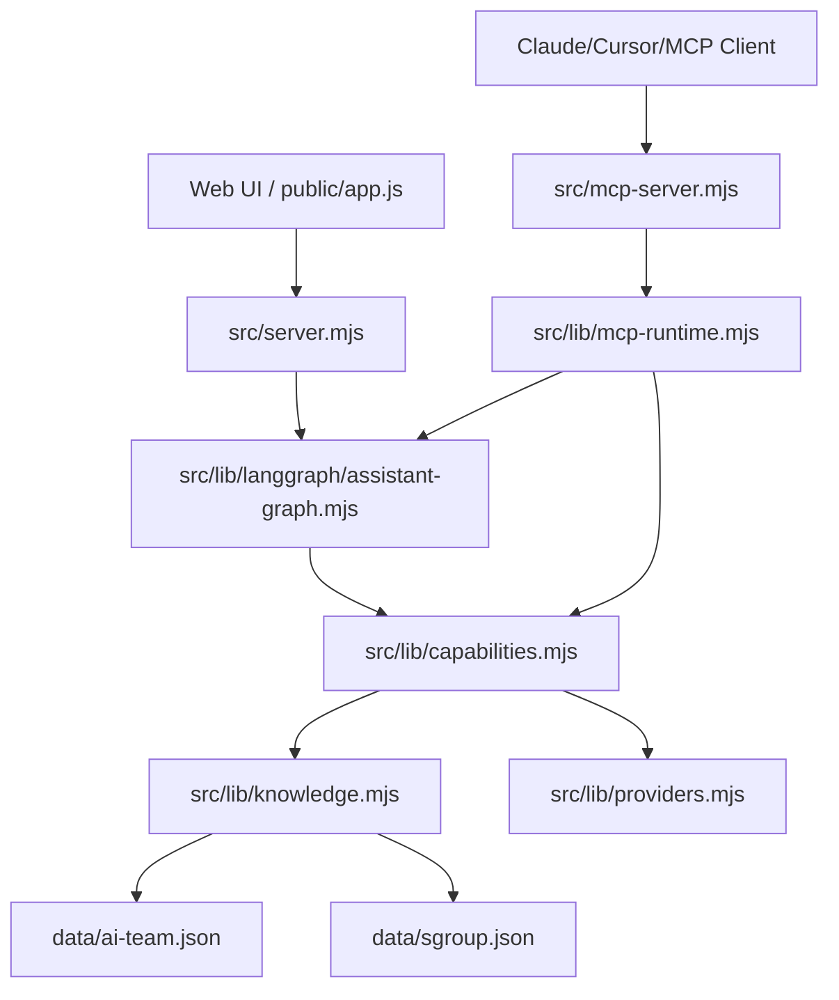
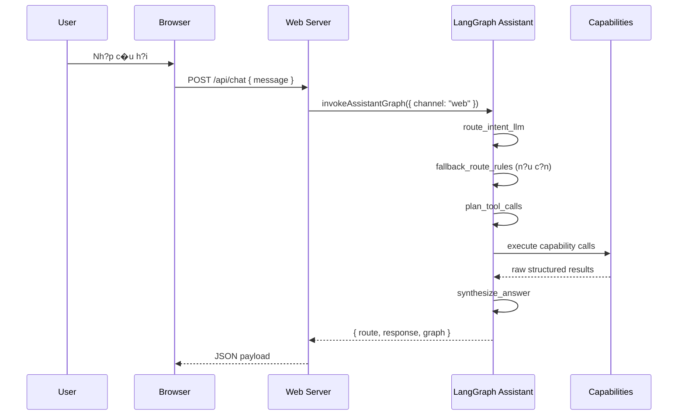
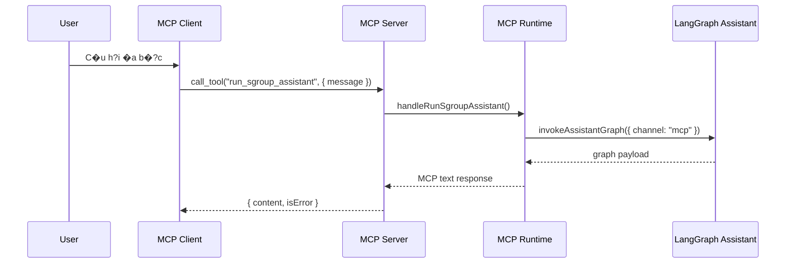

# Ki?n Tr�c H? Th?ng

## T?ng quan

Ki?n tr�c hi?n t?i g?m 4 kh?i ch�nh:

| Kh?i | File ch�nh | Vai tr? |
|---|---|---|
| Web adapter | `src/server.mjs` | Nh?n chat request t? UI v� tr? payload cho web |
| LangGraph orchestration | `src/lib/langgraph/assistant-graph.mjs` | Route, plan, execute, synthesize |
| MCP adapter | `src/mcp-server.mjs` | Expose tools/resources/prompts theo chu?n MCP |
| Capability/data layer | `src/lib/capabilities.mjs` | Truy xu?t knowledge v� providers theo raw structured output |

## Logical layers



## Web flow hi?n t?i



### Ghi ch�

- `src/lib/router.mjs` ch? l� fallback router rule-based.
- Web contract hi?n t?i g?m `route`, `response`, `graph`.
- UI render graph trace, executed nodes v� tool calls.

## MCP flow hi?n t?i

### Primitive tools

MCP client c� th? g?i tr?c ti?p c�c tool nh� `get_weather`, `get_news`, `search_it_knowledge`, `search_sgroup_knowledge`.

### Composite assistant flow

MCP client c?ng c� th? g?i `run_sgroup_assistant` �? d�ng chung assistant graph v?i web.



## Routing strategy

Routing hi?n t?i c 2 m?c:

1. **Primary route**: `LangGraph + Google Gemini structured output`
2. **Fallback route**: `src/lib/router.mjs`

Supported intents:
- `general`
- `weather`
- `news`
- `it-research`
- `sgroup-knowledge`
- `mixed-research`

## Capability execution

Capability layer tr? raw structured output d�ng chung cho c? graph v� MCP formatter.

Shape kh�i qu�t:

```json
{
  "kind": "news",
  "summary": "...",
  "items": [],
  "citations": [],
  "webUrl": "https://...",
  "fallbackUsed": true,
  "metadata": {}
}
```

## Th�nh ph?n kh�ng c?n l� execution path ch�nh

C�c file sau v?n c� th? c?n trong repo nh�ng kh�ng c?n l� ��?ng ch?y ch�nh:
- `src/lib/agents.mjs`
- `src/lib/chat-orchestrator.mjs`

N?u c?n d?n d?p ho�n to�n, �� l� b�?c cleanup ri�ng, kh�ng ph?i m� t? tr?ng th�i hi?n t?i.

## Ch? s? hi?n t?i

| H?ng m?c | Gi� tr? |
|---|---|
| Tools | 5 |
| Resources | 2 |
| Prompts | 7 |
| Test status | 46/46 pass |
| Web contract | `route` + `response` + `graph` |
