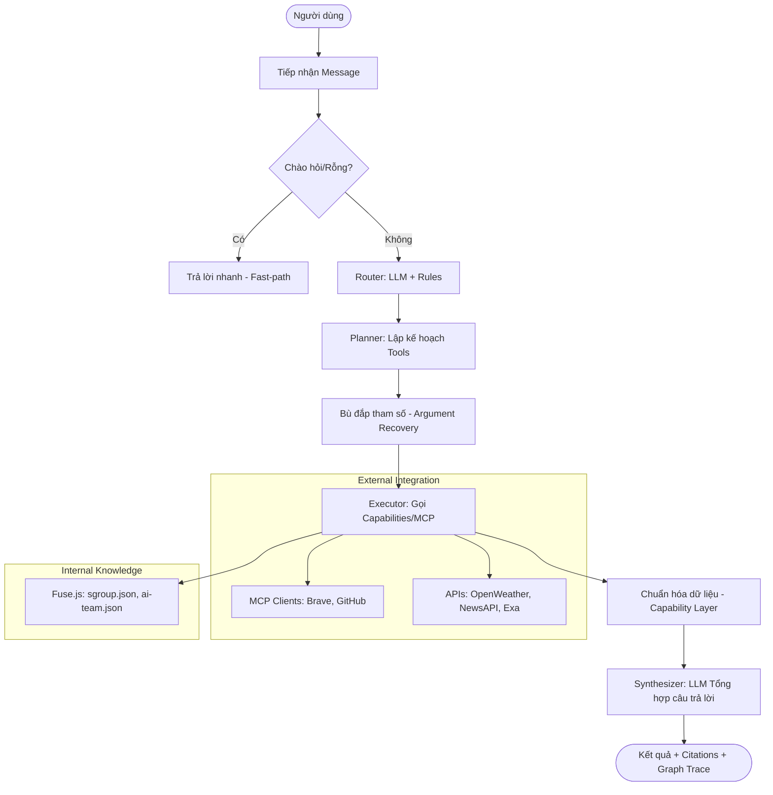

# Tổng quan Hệ thống SGroupWorkShop

**SGroupWorkShop** là một hệ thống Trợ lý ảo đa tác nhiệm (Multi-Agent Assistant) tiên tiến, được thiết kế để cung cấp thông tin tức thời về thời tiết, tin tức, nghiên cứu công nghệ (IT) và tri thức nội bộ của SGroup/AI Team. Hệ thống kết hợp sức mạnh của Mô hình ngôn ngữ lớn (LLM), kiến trúc đồ thị điều phối (Orchestration Graph) và giao thức MCP (Model Context Protocol) để đảm bảo tính linh hoạt và khả năng mở rộng.

## 1. Ngôi sao Công nghệ (Tech Stack)

* **LLM Core:** Gemini 2.5 Flash (Google Generative AI).
* **Orchestration:** LangGraph & LangChain (Điều phối luồng xử lý dạng đồ thị).
* **Protocol:** Model Context Protocol (MCP) - Cho phép tích hợp linh hoạt các công cụ bên ngoài (Brave Search, GitHub, v.v.).
* **Data Processing:**
  * **Fuzzy Search:** `fuse.js` (Tra cứu tri thức nội bộ).
  * **Validation:** `zod` (Đảm bảo cấu trúc dữ liệu đầu ra từ LLM).
* **External APIs:** OpenWeather (Thời tiết), NewsAPI & RSS (Tin tức), Exa AI (Tìm kiếm nghiên cứu IT).
* **Environment:** Node.js (ES Modules).

---

## 2. Kiến trúc 4 Lớp & Luồng Xử lý

Hệ thống được tổ chức theo mô hình phân lớp rõ ràng nhằm tách biệt trách nhiệm và tăng khả năng bảo trì:

### 2.1. Lớp Giao tiếp (Adapter Layer)

* **Web UI Adapter:** Tiếp nhận yêu cầu từ người dùng qua giao diện web.
* **MCP Server:** Cho phép hệ thống hoạt động như một "provider" công cụ cho các Agent khác.

### 2.2. Lớp Điều phối (Orchestration Layer - LangGraph)

Đây là "bộ não" của hệ thống, điều khiển luồng dữ liệu qua các nút (Nodes):

1. **Fast-path Detection:** Nhận diện lời chào hoặc tin nhắn rỗng để phản hồi ngay lập tức (~0ms latency), không cần gọi LLM.
2. **Intent Router (Dual-layer):**
   * **Lớp LLM:** Phân loại ý định vào các nhóm: `weather`, `news`, `it-research`, `sgroup-knowledge`, `mixed-research`, `github`.
   * **Lớp Rule-based:** Sử dụng các từ khóa (Hints) để bổ trợ và "cứu" các trường hợp LLM phân loại không chắc chắn.
3. **Tool Planner:** LLM lập kế hoạch gọi các công cụ (Tools) cụ thể dựa trên ý định và tham số trích xuất được.
4. **Self-Recovery:** Nếu LLM quên tham số (như địa điểm thời tiết), hệ thống tự động bù đắp từ dữ liệu thô của người dùng.

### 2.3. Lớp Năng lực (Capability Layer)

Chuẩn hóa dữ liệu từ nhiều nguồn thành một định dạng chung (Unified Result Format):

* `searchSgroupKnowledge`: Tra cứu trong `data/*.json`.
* `getNews`/`getWeather`: Điều phối giữa API chính và nguồn dự phòng.
* `readProjectDocument`: Đọc các tài liệu kỹ thuật chuyên sâu trong `data/docs/`.

### 2.4. Lớp Cung cấp dữ liệu (Provider Layer)

* **Internal Data:** Các tệp JSON (`ai-team.json`, `sgroup.json`, `sgroup-site.json`).
* **External Services:** Kết nối trực tiếp với OpenWeather, NewsAPI, Exa AI.

---

## 3. Các Tác nhân Chuyên trách (Specialist Agents)

Hệ thống hoạt động theo tư duy **Multi-Agent**, nơi Orchestrator điều phối các "chuyên gia":

| Agent | Vai trò | Công cụ chủ đạo |
| :--- | :--- | :--- |
| **Weather Specialist** | Cung cấp thông tin thời tiết thời gian thực. | `get_weather` |
| **News Specialist** | Cập nhật tin tức theo chủ đề hoặc danh mục. | `get_news` (NewsAPI/RSS) |
| **IT Specialist** | Nghiên cứu công nghệ và giải đáp lập trình. | `search_it_knowledge` (Exa/Brave) |
| **SGroup Specialist** | Chuyên gia về thông tin nội bộ SGroup/AI Team. | `search_sgroup_knowledge` |
| **Research Specialist** | Kết hợp cả nguồn tin kỹ thuật và nội bộ. | Mixed Tools |
| **GitHub Specialist** | Tra cứu mã nguồn, PRs và Issues. | External MCP (GitHub) |

---

## 4. Cơ chế Ổn định & Hiệu năng (Robustness)

* **Multi-level Fallback:**
  * NewsAPI lỗi -> Tự động chuyển sang RSS.
  * Thiếu API Key -> Trả về dữ liệu mẫu (Mock) kèm cảnh báo thay vì báo lỗi hệ thống.
* **Smart Caching:** Lưu trữ kết quả (Weather: 10p, News: 15p, Search: 1h) để giảm chi phí API và tăng tốc độ phản hồi.
* **Structured Output:** Sử dụng LLM với `withStructuredOutput` và Zod schema để đảm bảo dữ liệu luôn đúng định dạng máy có thể đọc.
* **Graph Trace:** Mỗi phản hồi đi kèm dấu vết thực thi (Executed Nodes) giúp kỹ thuật viên dễ dàng debug.

---

## 5. Sơ đồ Pipeline Chi tiết



---
> [!IMPORTANT]
> Toàn bộ hệ thống được thiết kế để **tự phục hồi (Self-healing)**. Nếu một mắt xích trong pipeline bị lỗi, các nút fallback sẽ kích hoạt để đảm bảo người dùng luôn nhận được một câu trả lời có ích nhất có thể.
p kế hoạch Tools]
    Plan --> Recovery[Bù đắp tham số - Argument Recovery]
    Recovery --> Exec[Executor: Gọi Capabilities/MCP]
    Exec --> Standard[Chuẩn hóa dữ liệu - Capability Layer]
    Standard --> Syn[Synthesizer: LLM Tổng hợp câu trả lời]
    Syn --> Out([Kết quả + Citations + Graph Trace])

    subgraph "External Integration"
        Exec --> MCP[MCP Clients: Brave, GitHub]
        Exec --> API[APIs: OpenWeather, NewsAPI, Exa]
    end

    subgraph "Internal Knowledge"
        Exec --> Fuse[Fuse.js: sgroup.json, ai-team.json]
    end
```

---
> [!IMPORTANT]
> Toàn bộ hệ thống được thiết kế để **tự phục hồi (Self-healing)**. Nếu một mắt xích trong pipeline bị lỗi, các nút fallback sẽ kích hoạt để đảm bảo người dùng luôn nhận được một câu trả lời có ích nhất có thể.
